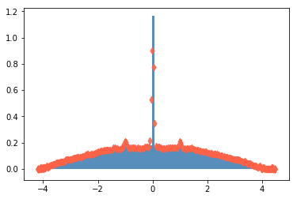

# 

eMaTe it is a python package which the main goal is to provide  methods capable of estimating the spectral densities and trace 
functions of large sparse matrices. eMaTe can run in both CPU and GPU and can estimate the spectral density and related trace functions, such as entropy and Estrada index, even in directed or undirected networks with million of nodes.

## Install                                                                                                              
```
pip install emate
```

If you a have a GPU you should also install cupy.
## Kernel Polynomial Method (KPM)

The Kernel Polynomial Method can estimate the spectral density of large sparse Hermitan matrices with a computational cost almost linear. This method combines three key ingredients: the Chebyshev expansion + the stochastic trace estimator + kernel smoothing.


### Example

```python
import igraph as ig
import numpy as np

N = 3000
G = ig.Graph.Erdos_Renyi(N, 3/N)

W = np.array(G.get_adjacency().data, dtype=np.float64)
vals = np.linalg.eigvalsh(W).real
```

```python
from emate.hermitian import tfkpm
from stdog.utils.misc import ig2sparse 

W = ig2sparse(G)

num_moments = 40
num_vecs = 40
extra_points = 10
ek, rho = tfkpm(W, num_moments, num_vecs, extra_points)
```

```python
import matplotlib.pyplot as plt
plt.hist(vals, density=True, bins=100, alpha=.9, color="steelblue")
plt.scatter(ek, rho, c="tomato", zorder=999, alpha=0.9, marker="d")

```
If the CUPY package it is available in your machine, you can also use the cupy implementation. When compared to tf-kpm, the
Cupy-kpm is slower for median matrices (100k) and faster for larger matrices (> 10^6). The main reason it's because the tf-kpm was implemented in order to calc all te moments in a single step. 

```python
from emate.hermitian import cupykpm

num_moments = 40
num_vecs = 40
extra_points = 10
ek, rho = cupykpm(W, num_moments, num_vecs, extra_points)
```




## Stochastic Lanczos Quadrature (SLQ)


>The problem of estimating the trace of matrix functions appears in applications ranging from machine learning and scientific computing, to computational biology.[2] 

### Example

#### Computing the Estrada index

```python
from emate.symmetric.slq import pyslq
import tensorflow as tf

def trace_function(eig_vals):
    return tf.exp(eig_vals)

num_vecs = 100
num_steps = 50
approximated_estrada_index, _ = pyslq(L_sparse, num_vecs, num_steps,  trace_function)
exact_estrada_index =  np.sum(np.exp(vals_laplacian))
approximated_estrada_index, exact_estrada_index
```
The above code returns

```
(3058.012, 3063.16457163222)
```
#### Entropy
```python
import scipy
import scipy.sparse

def entropy(eig_vals):
  s = 0.
  for val in eig_vals:
    if val > 0:
      s += -val*np.log(val)
  return s

L = np.array(G.laplacian(normalized=True), dtype=np.float64)
vals_laplacian = np.linalg.eigvalsh(L).real

exact_entropy =  entropy(vals_laplacian)


def trace_function(eig_vals):
  def entropy(val):
    return tf.cond(val>0, lambda:-val*tf.log(val), lambda: 0.)
  
  return tf.map_fn(entropy, eig_vals)
 
L_sparse = scipy.sparse.coo_matrix(L)
    
num_vecs = 100
num_steps = 50
approximated_entropy, _ = pyslq(L_sparse, num_vecs, num_steps,  trace_function)

approximated_entropy, exact_entropy
```
```
(-509.46283, -512.5283224633046)
```
[[1] Hutchinson, M. F. (1990). A stochastic estimator of the trace of the influence matrix for laplacian smoothing splines. Communications in Statistics-Simulation and Computation, 19(2), 433-450.](https://www.tandfonline.com/doi/abs/10.1080/03610919008812866)

[[2] Ubaru, S., Chen, J., & Saad, Y. (2017). Fast Estimation of tr(f(A)) via Stochastic Lanczos Quadrature. SIAM Journal on Matrix Analysis and Applications, 38(4), 1075-1099.](https://epubs.siam.org/doi/abs/10.1137/16M1104974)


 

